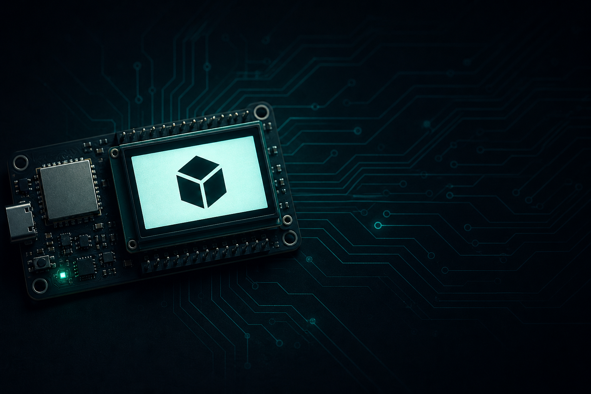

<p align="center">
  
</p>

<h1 align="center">ESP32-S3 Lab</h1>

<p align="center">
  <strong>Desk companion</strong> en una Waveshare ESP32-S3-LCD-1.47B:<br/>
  un firmware, varias “apps”, y datos en vivo desde tu Mac.
</p>

<p align="center">
  
  
  
  
</p>

---

## Intro

Este proyecto es un lab de portfolio: la placa no es un blink más, es un **carrusel de views** en pantalla chica.

Con el botón **BOOT** pasás entre modos. Cada view tiene su carpeta, su README y (si hace falta) un tool en Mac que le manda datos por HTTP — sin meter secretos en el repo.

Ideal para mostrar en un portfolio: hardware real, firmware organizado, integraciones útiles y documentación lista para GitHub público.

## Views

| BOOT | View | Qué hace | Código |
|:----:|------|----------|--------|
| 1 | **Cursor Buddy** | Eventos del Agent + barras de uso Pro + globos | [`src/views/cursor_buddy/`](src/views/cursor_buddy/) |
| 2 | **Keyboard Presence** | Tipado real, WPM, idle, heatmap tipo contributions | [`src/views/keyboard/`](src/views/keyboard/) |
| 3 | **Trello Buddy** | In Progress + vencimientos / overdue | [`src/views/trello/`](src/views/trello/) |

```text
BOOT → Cursor → Keys → Trello → …
RESET → reinicia el chip (no navega)
```

## Stack

- **MCU:** ESP32-S3 (Waveshare LCD 1.47B, 16MB flash + 8MB PSRAM)
- **UI:** ST7789 172×320 + sprites / canvas offscreen
- **Sensores:** QMI8658 (IMU) para motion sutil del buddy
- **Host tools:** Python pollers (`tools/*/`) → `POST /event` `/usage` `/keys` `/trello`

## Quick start

```bash
cp include/secrets.h.example include/secrets.h   # Wi‑Fi 2.4 GHz only
pio run -t upload
```

Pollers (Mac):

```bash
./tools/cursor_usage/run.sh --once
./tools/keyboard_presence/run.sh --demo
./tools/trello/run.sh --demo --once
```

La IP aparece en la LCD. Opcional: `~/.cursor/esp32-buddy.json`.

## Estructura

```text
src/
  main.cpp              # Wi‑Fi, HTTP, BOOT, loop
  core/                 # pines + IMU
  views/<name>/         # cada slide + README
tools/<name>/           # pollers + README + run.sh
docs/                   # architecture, security, ideas, assets
.cursor/rules/          # steering para agentes
```

## Documentación

| Doc | Contenido |
|-----|-----------|
| [`docs/ARCHITECTURE.md`](docs/ARCHITECTURE.md) | Mapa del sistema y cómo agregar views |
| [`docs/SECURITY.md`](docs/SECURITY.md) | Secretos y checklist antes de hacer público |
| [`docs/IDEAS.md`](docs/IDEAS.md) | Roadmap |
| [`AGENTS.md`](AGENTS.md) | Notas para coding agents |
| [`.cursor/rules/`](.cursor/rules/) | Reglas de steering |

## Seguridad (portfolio / repo público)

Listo para publicar si mantenés fuera del git:

- `include/secrets.h` (Wi‑Fi)
- `~/.cursor/trello.json` (API Trello)
- tokens de Cursor (solo se leen en vivo, no se guardan aquí)

Ver el checklist en [`docs/SECURITY.md`](docs/SECURITY.md).

## Licencia

Usá y forkeá libremente para labs y portfolio. Atribuí si te sirve.
